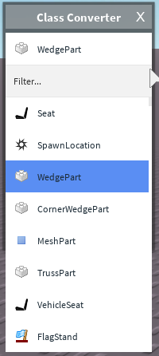

<h1 align="center">Quenty's Class Converter</h1>

Convert between classes, loading from Anaminus's API dump. Inspired by Stravant's ClassChanger. With help from badcc, AxisAngles, Anaminus and Stravant.

You can find the published version [here](https://www.roblox.com/library/906681627/Quentys-Class-Converter).


### Installing

1. Open up Roblox Studio
2. Open up a new place, go to the Plugins tab, then manage plugins
3. Navigate to https://www.roblox.com/library/906681627/Quentys-Class-Converter 
4. Press Install

### Features

* Always up to date API
* Fuzzy searching
* Nice UI
* Converts CollectionService tags

### Caveats

* Requires HttpEnabled to be on

### UI

Here's an example of the UI



### Building the plugin
This plugin is built with [Rojo](https://github.com/LPGhatguy/rojo).

Run 

```rojo serve```

from the root directory and then sync using the Rojo plugin.


### Syntax checking
Syntax checking is done with LuaCheck

### Dependencies
This plugin uses http://anaminus.github.io/rbx/json/api/latest.json to grab updates
